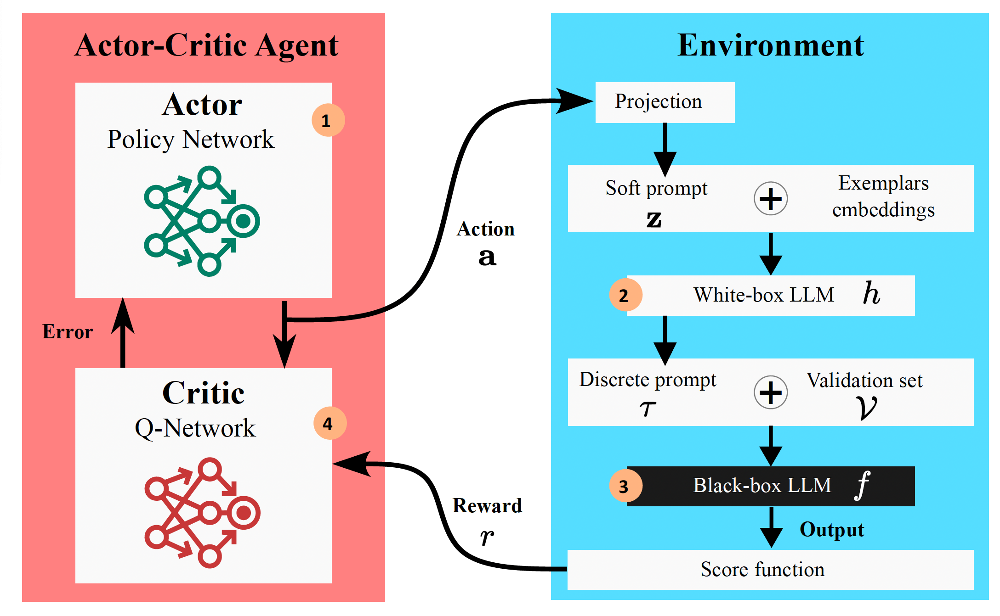

# ACING: Actor-Critic for Instruction Learning in Black-Box Large Language Models
Salma Kharrat, Fares Fourati, Marco Canini

[ArXiv](https://arxiv.org/abs/2411.12736) | [PDF](https://arxiv.org/pdf/2411.12736)

This is the code for the paper: ACING: Actor-Critic for Instruction Learning
in Black-Box Large Language Models. We provide all the codes for our experiments which includes instruction induction and summarization tasks. 

Our code is based on the codes from [APE](https://github.com/keirp/automatic_prompt_engineer), [InstructZero](https://github.com/Lichang-Chen/InstructZero) and [Instinct](https://github.com/xqlin98/INSTINCT).


# Abstract
The effectiveness of Large Language Models (LLMs) in solving tasks vastly depends on the quality of the instructions, which often require fine-tuning through extensive human effort.
This highlights the need for automated instruction optimization; however, this optimization is particularly challenging when dealing with black-box LLMs, where model parameters and gradients remain inaccessible.

We propose ACING, a task-specific prompt optimization approach framed as a stateless continuous-action Reinforcement Learning (RL) problem, known as the continuum bandit setting.
ACING leverages an actor-critic-based method to optimize prompts, learning from non-differentiable reward signals. We validate ACING by optimizing prompts for ChatGPT on 30 instruction-based tasks, as well as a summarization task. ACING consistently outperforms baseline methods, achieving a median score improvement of 10 percentage points compared to the best baseline considered. Furthermore, ACING not only recovers but also surpasses human-crafted expert instructions, achieving up to a 39 percentage point improvement over human benchmarks.

# ACING Pipeline
In each iteration, a soft prompt along with several examples of the target task are provided to the white-box LLM to generate an instruction. This instruction is then used to query the black-box LLM, which produces answers to the target task queries. The resulting score is returned to the agent as a reward, which is used to update its networks and adjust its policy. Both LLMs remain frozen throughout the process.




# Run ACING
To run the code, you need to install the environment using conda:
`conda env create -f environment.yml`

We provide bash scripts for running our experiments for instruction induction at `Induction/experiments/run_ACING.sh`. To run it properly, you need to run the following in the terminal:
```
cd Induction
bash experiments/run_ACING.sh
```

To run summarization task: 
```
cd Induction
bash experiments/run_ACING_summarization.sh
```

Before running you need to specify your OPENAI_API_KEY in the .sh files to be able to use the chosen gpt. 

# Citation
If you use our code please cite us as follows:
```
@article{kharrat2024acing,
  title={ACING: Actor-Critic for Instruction Learning in Black-Box Large Language Models},
  author={Kharrat, Salma and Fourati, Fares and Canini, Marco},
  journal={arXiv preprint arXiv:2411.12736},
  year={2024}
}
```